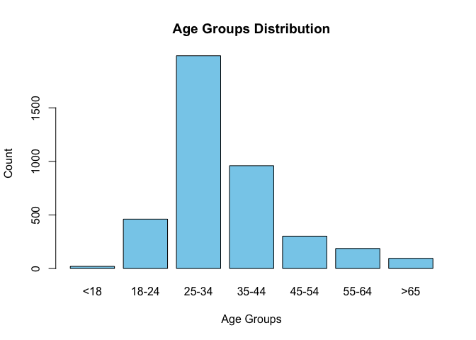
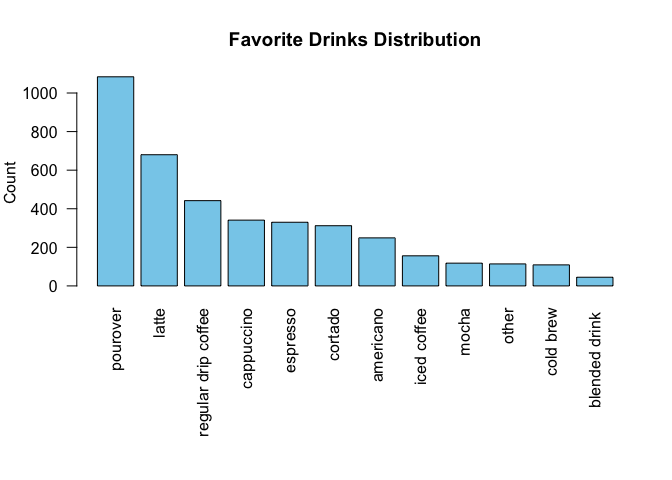

# Exploratory Data Analysis


<script src="eda_files/libs/kePrint-0.0.1/kePrint.js"></script>
<link href="eda_files/libs/lightable-0.0.1/lightable.css" rel="stylesheet" />


## Research Question:

-   Can coffee consumers be grouped into distinct customer-classes based
    on self-reported data? What customer-class demographic spends the
    most at corporate coffee chains? What characteristics separate
    consumers from other classes of consumers?

## Analysis Objective:

-   Using CBA - Clustering for Business Analytics by Christian Buchta, I
    am looking to identify distinct “customer-classes” by analyzing
    individual, self reported data on their coffee drinking habits
    (location, preferred roast, preferred brand, home coffee spending)
    and demographic characteristics such as their age, gender, race,
    educational background, and number of children. Identifying
    prominent characteristics that lead to vast differences in consumer
    spending can be beneficial to any corporation looking to target the
    right kind of consumers through advertising.

## Data:

Using data from a 2023 survey of “Great American Coffee Taste Test”
viewers, I will be exploring consumer trends of American coffee
enthusiasts, primarily through spending demographics and coffee
preferences.

All of the data comes from the following TidyTuesday publication:
<https://github.com/rfordatascience/tidytuesday/blob/main/data/2024/2024-05-14/readme.md>

Some variables from this study that will be important for grouping
consumers into customer-classes include:

cups: How many cups of coffee do you typically drink per day?

where_drink: Where do you typically drink coffee?

brew: How do you brew coffee at home?

purchase: On the go, where do you typically purchase coffee?

favorite: What is your favorite coffee drink?

additions: Do you usually add anything to your coffee?

expertise: how would you rate your own coffee expertise?

total_spend: In total, much money do you typically spend on coffee in a
month?

number_children: Number of Children

employment_status: Employment Status

gender: Gender

age: Age

ethnicity_race: Ethnicity/Race

education_level: Education Level

## Exploratory Data Analysis

### Download Data + Data Cleaning

``` r
source("functions/preprocess.R")
```

    ── Attaching core tidyverse packages ──────────────────────── tidyverse 2.0.0 ──
    ✔ dplyr     1.1.4     ✔ readr     2.1.5
    ✔ forcats   1.0.0     ✔ stringr   1.5.1
    ✔ ggplot2   3.5.1     ✔ tibble    3.2.1
    ✔ lubridate 1.9.4     ✔ tidyr     1.3.1
    ✔ purrr     1.0.2     
    ── Conflicts ────────────────────────────────────────── tidyverse_conflicts() ──
    ✖ dplyr::filter() masks stats::filter()
    ✖ dplyr::lag()    masks stats::lag()
    ℹ Use the conflicted package (<http://conflicted.r-lib.org/>) to force all conflicts to become errors

    Attaching package: 'janitor'


    The following objects are masked from 'package:stats':

        chisq.test, fisher.test


    here() starts at /Users/luke/Documents/GitHub/Stat155

    Rows: 4042 Columns: 113
    ── Column specification ────────────────────────────────────────────────────────
    Delimiter: ","
    chr (44): Submission ID, What is your age?, How many cups of coffee do you t...
    dbl (13): Lastly, how would you rate your own coffee expertise?, Coffee A - ...
    lgl (56): Where do you typically drink coffee? (At home), Where do you typic...

    ℹ Use `spec()` to retrieve the full column specification for this data.
    ℹ Specify the column types or set `show_col_types = FALSE` to quiet this message.

### Exploring Important Features

``` r
# Exploring Age Distribution
# Cleaning up the age variable, using the gsub function to replace / remove uneeded words for the visual. 
coffee_survey$age_clean <- tolower(coffee_survey$age) #Converts age to lowercase for string handling
coffee_survey$age_clean <- gsub("years old", "", coffee_survey$age_clean)
coffee_survey$age_clean <- gsub("to", "-", coffee_survey$age_clean)

coffee_survey$age_clean <- trimws(coffee_survey$age_clean) #trim whitespace

#Re-order through factoring
age_levels <- c("<18", "18-24", "25-34", "35-44", "45-54", "55-64", ">65")
coffee_survey$age_clean <- factor(coffee_survey$age_clean, levels = age_levels)

barplot(table(coffee_survey$age_clean), #Table provides named list, containing the counts of each age group
        col = "skyblue", 
        main = "Age Groups Distribution", 
        ylab = "Count",
        xlab = 'Age Groups')
```



This study primarily includes individuals in the 25-34 age range, with
1986 total individuals, roughly 49% of the study population. Very few
individuals are at the extremes of the age spectrum, under 18 or over
65. Roughly 87% of the participants are over the age of 24, suggesting
that this study primarily reached older consumers.

``` r
#Distribution of Favorite Drinks
coffee_survey$favorite_clean <- tolower(coffee_survey$favorite)
coffee_survey$favorite_clean <- gsub("(e.g. frappuccino)", "", coffee_survey$favorite_clean) #No need for this clarification
coffee_survey$favorite_clean <- gsub("()", "", coffee_survey$favorite_clean, fixed = TRUE) #fixed = TRUE tells R not to treat characters like () as special regex symbols. 

par(mar = c(10, 4, 4, 2))  # Bottom, left, top, right margins
barplot(sort(table(coffee_survey$favorite_clean), decreasing = TRUE),
        col = "skyblue",
        las = 2,
        main = "Favorite Drinks Distribution",
        ylab = "Count")
```



The most popular “favorite” among these consumers is the pourover, with
approximately 26% of individuals reporting it as their favorite coffee
drink. This is considered one of the easiest (and often cheapest) drinks
to enjoy, so this is not surprising. A very low proportion of
individuals enjoy blended drinks like frappucinos, with only 45 survey
respondents reporting them as their favorite drinks. We can also explore
the most popular favorite for each age category.

``` r
library(dplyr)
library(kableExtra)
```


    Attaching package: 'kableExtra'

    The following object is masked from 'package:dplyr':

        group_rows

``` r
top_drinks <- coffee_survey %>%
  filter(!is.na(age_clean)) %>% 
  group_by(age_clean, favorite) %>%
  summarise(count = n(), .groups = "drop") %>%
  arrange(age_clean, desc(count)) %>%
  group_by(age_clean) %>%
  slice(1)

top_drinks %>%
  kable(col.names = c("Age Group", "Favorite Drink", "Count")) %>%
  kable_styling(bootstrap_options = c("striped", "hover"), full_width = FALSE, position = "center") %>%
  row_spec(0, bold = TRUE, background = "lightgray")
```

<table class="table table-striped table-hover"
data-quarto-postprocess="true"
style="width: auto !important; margin-left: auto; margin-right: auto;">
<thead>
<tr>
<th data-quarto-table-cell-role="th"
style="text-align: left; font-weight: bold; background-color: lightgray !important;">Age
Group</th>
<th data-quarto-table-cell-role="th"
style="text-align: left; font-weight: bold; background-color: lightgray !important;">Favorite
Drink</th>
<th data-quarto-table-cell-role="th"
style="text-align: right; font-weight: bold; background-color: lightgray !important;">Count</th>
</tr>
</thead>
<tbody>
<tr>
<td style="text-align: left;">&lt;18</td>
<td style="text-align: left;">Latte</td>
<td style="text-align: right;">8</td>
</tr>
<tr>
<td style="text-align: left;">18-24</td>
<td style="text-align: left;">Pourover</td>
<td style="text-align: right;">103</td>
</tr>
<tr>
<td style="text-align: left;">25-34</td>
<td style="text-align: left;">Pourover</td>
<td style="text-align: right;">566</td>
</tr>
<tr>
<td style="text-align: left;">35-44</td>
<td style="text-align: left;">Pourover</td>
<td style="text-align: right;">273</td>
</tr>
<tr>
<td style="text-align: left;">45-54</td>
<td style="text-align: left;">Pourover</td>
<td style="text-align: right;">78</td>
</tr>
<tr>
<td style="text-align: left;">55-64</td>
<td style="text-align: left;">Regular drip coffee</td>
<td style="text-align: right;">40</td>
</tr>
<tr>
<td style="text-align: left;">&gt;65</td>
<td style="text-align: left;">Regular drip coffee</td>
<td style="text-align: right;">32</td>
</tr>
</tbody>
</table>

The for those from 18-54, the most frequently reported favorite drink is
the pourover. Those who are 55+ tend to prefer regular drip coffee,
while those below 18 reportedly enjoy Lattes the most. I believe this
breakdown may be vastly different when further dividing the groups by
gender.

``` r
#Grouping By Age and Gender to see their favorite drinks 
top_drinks %>%
  kable() %>%
  kable_styling(bootstrap_options = "striped", full_width = F)
```

<table class="table table-striped" data-quarto-postprocess="true"
style="width: auto !important; margin-left: auto; margin-right: auto;">
<thead>
<tr>
<th style="text-align: left;"
data-quarto-table-cell-role="th">age_clean</th>
<th style="text-align: left;"
data-quarto-table-cell-role="th">favorite</th>
<th style="text-align: right;"
data-quarto-table-cell-role="th">count</th>
</tr>
</thead>
<tbody>
<tr>
<td style="text-align: left;">&lt;18</td>
<td style="text-align: left;">Latte</td>
<td style="text-align: right;">8</td>
</tr>
<tr>
<td style="text-align: left;">18-24</td>
<td style="text-align: left;">Pourover</td>
<td style="text-align: right;">103</td>
</tr>
<tr>
<td style="text-align: left;">25-34</td>
<td style="text-align: left;">Pourover</td>
<td style="text-align: right;">566</td>
</tr>
<tr>
<td style="text-align: left;">35-44</td>
<td style="text-align: left;">Pourover</td>
<td style="text-align: right;">273</td>
</tr>
<tr>
<td style="text-align: left;">45-54</td>
<td style="text-align: left;">Pourover</td>
<td style="text-align: right;">78</td>
</tr>
<tr>
<td style="text-align: left;">55-64</td>
<td style="text-align: left;">Regular drip coffee</td>
<td style="text-align: right;">40</td>
</tr>
<tr>
<td style="text-align: left;">&gt;65</td>
<td style="text-align: left;">Regular drip coffee</td>
<td style="text-align: right;">32</td>
</tr>
</tbody>
</table>

In many instances, women favor Lattes while men favor pourovers. Older
women still favor regular drip coffee or pourovers, however from ages
18-54 we see a switch towards lattes. Men in every instance except below
18 self report that they favor pourovers or regular drip coffee.
