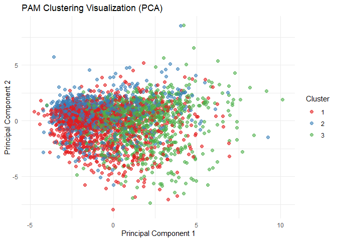

# Exploratory Data Analysis


# Introduction and Data

-   Using Grower/PAM clustering for categorical (one-hot encoded) data,
    I am looking to identify distinct “customer-classes” by analyzing
    individual, self reported data on their coffee drinking habits
    (location, preferred roast, preferred drinking location, reason for
    drinking coffee) and demographic characteristics such as their age,
    gender, educational background, and number of children. Identifying
    prominent characteristics that lead to vast differences in consumer
    spending can be beneficial to any corporation looking to target the
    right kind of consumers through advertising.

# Methodology

-   Clustering provides a way to group individual observations into
    natural “clusters” through distances in their observable features.
    These differences between features can be defined in many ways,
    however for the main analysis we will be using Grower / PAM
    clustering to identify differences between observations. For
    example, if two individuals report that they prefer dark roast, they
    will have a relatively short distance and could potentially end up
    in the same cluster, provided other survey responses are similar.
    This is done for every observation, and all of our chosen
    covariates. Individuals with similar coffee preferences and habits
    will be clustered together into one of 3 clusters, hopefully
    providing us with 3 unique/distinct customer groups.

## Rock Clustering Analysis

``` r
#Preprocess & Load Data:
source("functions/preprocess.R")
```

    ── Attaching core tidyverse packages ──────────────────────── tidyverse 2.0.0 ──
    ✔ dplyr     1.1.4     ✔ readr     2.1.5
    ✔ forcats   1.0.0     ✔ stringr   1.5.1
    ✔ ggplot2   3.5.1     ✔ tibble    3.2.1
    ✔ lubridate 1.9.4     ✔ tidyr     1.3.1
    ✔ purrr     1.0.2     
    ── Conflicts ────────────────────────────────────────── tidyverse_conflicts() ──
    ✖ dplyr::filter() masks stats::filter()
    ✖ dplyr::lag()    masks stats::lag()
    ℹ Use the conflicted package (<http://conflicted.r-lib.org/>) to force all conflicts to become errors

    Attaching package: 'janitor'


    The following objects are masked from 'package:stats':

        chisq.test, fisher.test


    here() starts at /Users/luke/Documents/GitHub/Stat155

    Rows: 4042 Columns: 113
    ── Column specification ────────────────────────────────────────────────────────
    Delimiter: ","
    chr (44): Submission ID, What is your age?, How many cups of coffee do you t...
    dbl (13): Lastly, how would you rate your own coffee expertise?, Coffee A - ...
    lgl (56): Where do you typically drink coffee? (At home), Where do you typic...

    ℹ Use `spec()` to retrieve the full column specification for this data.
    ℹ Specify the column types or set `show_col_types = FALSE` to quiet this message.

    Submission ID
    What is your age?
    How many cups of coffee do you typically drink per day?
    Where do you typically drink coffee?
    Where do you typically drink coffee? (At home)
    Where do you typically drink coffee? (At the office)
    Where do you typically drink coffee? (On the go)
    Where do you typically drink coffee? (At a cafe)
    Where do you typically drink coffee? (None of these)
    How do you brew coffee at home?
    How do you brew coffee at home? (Pour over)
    How do you brew coffee at home? (French press)
    How do you brew coffee at home? (Espresso)
    How do you brew coffee at home? (Coffee brewing machine (e.g. Mr. Coffee))
    How do you brew coffee at home? (Pod/capsule machine (e.g. Keurig/Nespresso))
    How do you brew coffee at home? (Instant coffee)
    How do you brew coffee at home? (Bean-to-cup machine)
    How do you brew coffee at home? (Cold brew)
    How do you brew coffee at home? (Coffee extract (e.g. Cometeer))
    How do you brew coffee at home? (Other)
    How else do you brew coffee at home?
    On the go, where do you typically purchase coffee?
    On the go, where do you typically purchase coffee? (National chain (e.g. Starbucks, Dunkin))
    On the go, where do you typically purchase coffee? (Local cafe)
    On the go, where do you typically purchase coffee? (Drive-thru)
    On the go, where do you typically purchase coffee? (Specialty coffee shop)
    On the go, where do you typically purchase coffee? (Deli or supermarket)
    On the go, where do you typically purchase coffee? (Other)
    Where else do you purchase coffee?
    What is your favorite coffee drink?
    Please specify what your favorite coffee drink is
    Do you usually add anything to your coffee?
    Do you usually add anything to your coffee? (No - just black)
    Do you usually add anything to your coffee? (Milk, dairy alternative, or coffee creamer)
    Do you usually add anything to your coffee? (Sugar or sweetener)
    Do you usually add anything to your coffee? (Flavor syrup)
    Do you usually add anything to your coffee? (Other)
    What else do you add to your coffee?
    What kind of dairy do you add?
    What kind of dairy do you add? (Whole milk)
    What kind of dairy do you add? (Skim milk)
    What kind of dairy do you add? (Half and half)
    What kind of dairy do you add? (Coffee creamer)
    What kind of dairy do you add? (Flavored coffee creamer)
    What kind of dairy do you add? (Oat milk)
    What kind of dairy do you add? (Almond milk)
    What kind of dairy do you add? (Soy milk)
    What kind of dairy do you add? (Other)
    What kind of sugar or sweetener do you add?
    What kind of sugar or sweetener do you add? (Granulated Sugar)
    What kind of sugar or sweetener do you add? (Artificial Sweeteners (e.g., Splenda))
    What kind of sugar or sweetener do you add? (Honey)
    What kind of sugar or sweetener do you add? (Maple Syrup)
    What kind of sugar or sweetener do you add? (Stevia)
    What kind of sugar or sweetener do you add? (Agave Nectar)
    What kind of sugar or sweetener do you add? (Brown Sugar)
    What kind of sugar or sweetener do you add? (Raw Sugar (Turbinado))
    What kind of flavorings do you add?
    What kind of flavorings do you add? (Vanilla Syrup)
    What kind of flavorings do you add? (Caramel Syrup)
    What kind of flavorings do you add? (Hazelnut Syrup)
    What kind of flavorings do you add? (Cinnamon (Ground or Stick))
    What kind of flavorings do you add? (Peppermint Syrup)
    What kind of flavorings do you add? (Other)
    What other flavoring do you use?
    Before today's tasting, which of the following best described what kind of coffee you like?
    How strong do you like your coffee?
    What roast level of coffee do you prefer?
    How much caffeine do you like in your coffee?
    Lastly, how would you rate your own coffee expertise?
    Coffee A - Bitterness
    Coffee A - Acidity
    Coffee A - Personal Preference
    Coffee A - Notes
    Coffee B - Bitterness
    Coffee B - Acidity
    Coffee B - Personal Preference
    Coffee B - Notes
    Coffee C - Bitterness
    Coffee C - Acidity
    Coffee C - Personal Preference
    Coffee C - Notes
    Coffee D - Bitterness
    Coffee D - Acidity
    Coffee D - Personal Preference
    Coffee D - Notes
    Between Coffee A, Coffee B, and Coffee C which did you prefer?
    Between Coffee A and Coffee D, which did you prefer?
    Lastly, what was your favorite overall coffee?
    Do you work from home or in person?
    In total, much money do you typically spend on coffee in a month?
    Why do you drink coffee?
    Why do you drink coffee? (It tastes good)
    Why do you drink coffee? (I need the caffeine)
    Why do you drink coffee? (I need the ritual)
    Why do you drink coffee? (It makes me go to the bathroom)
    Why do you drink coffee? (Other)
    Other reason for drinking coffee
    Do you like the taste of coffee?
    Do you know where your coffee comes from?
    What is the most you've ever paid for a cup of coffee?
    What is the most you'd ever be willing to pay for a cup of coffee?
    Do you feel like you’re getting good value for your money when you buy coffee at a cafe?
    Approximately how much have you spent on coffee equipment in the past 5 years?
    Do you feel like you’re getting good value for your money with regards to your coffee equipment?
    Gender
    Gender (please specify)
    Education Level
    Ethnicity/Race
    Ethnicity/Race (please specify)
    Employment Status
    Number of Children
    Political Affiliation

``` r
library(cba)
```

    Loading required package: grid
    Loading required package: proxy

    Attaching package: 'proxy'

    The following objects are masked from 'package:stats':

        as.dist, dist

    The following object is masked from 'package:base':

        as.matrix

``` r
library(dplyr)
library(cluster)
set.seed(2)

#Columns selected for clustering (categorical only)
vars <- c(
  "where_drink", #Where do you drink coffee?
  "number_children", #How many children do you have?
  "brew", #Favorite brew?
  "additions", #Favorite addition to your coffee?
  "style", #Favoriate coffee style?
  "roast_level", #Preffered roast level?
  "caffeine", #How much caffine do you like in your coffe?
  "expertise", #How would you rate your own coffee expertise?
  "why_drink", #Why do you drink coffee?
  "taste", #Do you like the taste of coffee?
  "know_source", #Do you know where your coffee is sourced from?
  "value_cafe", #Do you feel cafe coffee is good value?
  "gender", #What is your gender?
  "education_level", #What is your education level?
  "employment_status",#What is your employment status?
  'most_paid', #What is the most you've ever paid for a cup of coffee?
  'ethnicity_race', #What is your ethnicity/race
  'spent_equipment', #how much spent on coffee equipment in the past 5 years?
  "wfh", #Do you work from home?
  'cups', #How many cups of coffee do you typically drink a day?
  'age', #What is your age?
  "total_spend", #how much do you typically spend on coffee in a month?
  'favorite' # What is your favorite coffee drink?
)

#Subset and clean data
coffee <- coffee_survey[, vars]
coffee_clean <- na.omit(coffee)

#Ensure all variables are factors
coffee_clean[] <- lapply(coffee_clean, function(x) {
  if (is.character(x)) as.factor(x) else x
})

#Compute Gower distance
gower_dist <- daisy(coffee_clean, metric = "gower")
gower_matrix <- as.matrix(gower_dist)

#Use PAM for Gower
pam_model <- pam(gower_dist, k = 3, diss = TRUE)
coffee_clean$cluster <- pam_model$clustering
table(coffee_clean$cluster)
```


       1    2    3 
    1218  827  925 

``` r
#Add cluster assignments
coffee_clean$cluster <- factor(pam_model$clustering)

#One-hot encode for PCA
coffee_onehot <- model.matrix(~ . - 1, data = coffee_clean[, -ncol(coffee_clean)])  # Exclude cluster column

#Run PCA to visualize clusters in 2 dimensions
pca_result <- prcomp(coffee_onehot, center = TRUE, scale. = TRUE)

#Creating data frame for ggplot
pca_df <- data.frame(
  PC1 = pca_result$x[, 1],
  PC2 = pca_result$x[, 2],
  Cluster = coffee_clean$cluster
)

#Plot
ggplot(pca_df, aes(x = PC1, y = PC2, color = Cluster)) +
  geom_point(alpha = 0.6, size = 2) +
  labs(title = "PAM Clustering Visualization (PCA)",
       x = "Principal Component 1", y = "Principal Component 2") +
  theme_minimal() +
  scale_color_brewer(palette = "Set1")
```



# Results

-   From initial observations, it appears that factoring/one-hot
    encoding survey data does not provide enough distance between each
    observation to distinctively separate them into unique, well defined
    clusters. After attempting to use ROCK clustering from the CBA
    package, and obtaining similar results, I switched to Grower/PAM
    which handles one-hot encoded categorical data and obtained similar
    results. We can see that there is a very large amount of overlap
    between the 3 clusters, and through further parameter tuning /
    changing of the amount of clusters, I have been unable to identify
    well-defined, separate groupings based on this survey data. Outliers
    seem to be members of all 3 clusters, and there does not seem to be
    any real evidence that members of each cluster are truly different
    from one another based on the current observable characteristics /
    principal components created for the 2d visual plot.

-   This likely occurs because members of the 2023 survey of “Great
    American Coffee Taste Test” viewers were all likely similar in many
    aspects, including observable aspects like coffee preferences and
    consumer habits. If the viewers are all very similar in their coffee
    preferences, and we force our clustering algorithm to sort them into
    clusters regardless, we end up with a cloud of multiple clusters,
    with no defined unique groupings. Even with further survey data, if
    the individuals of the survey are all closely similar to each other
    in their daily coffee consuming habits, we likely will not be able
    to create well defined clusters. It is obvious that this sample
    alone cannot be used to make predictions on the behavior of other
    American coffee consumers due to the selection bias within our
    sample of these survey respondents.

# 
